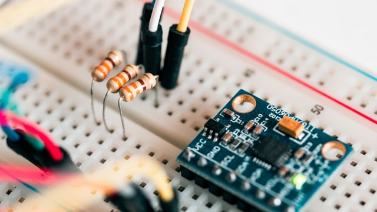
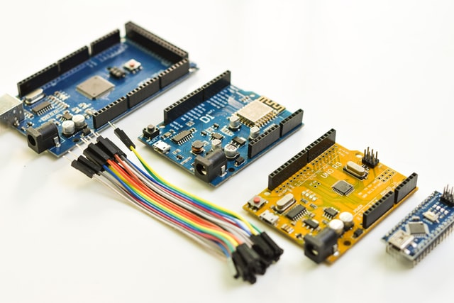

# Macro_Keypad

Low-cost Arduino-based fully customizable 8 key macro keypad with relegendable keycaps. 

  <kbd>
    
  </kbd>

## Description

This small 4x2 macro keypad offers 8 fully customizeable keys at easy reach for productivity, creative work, gaming, or other use cases. Set each key to any combination of button presses and add your own icons to the relegendable keycaps to have any shortcut, macro, or keybind ready at the push of a button. The custom PCB provides a rigid deck for the keys, as well as n-key rollover and LED backlighting. The 3D printed case angles the keys towards you for ease of use and rubber feet for grip on a slick desk.

### Features

- Low-cost, especially compared to similar products on the market ([Elgato Stream Deck](https://www.elgato.com/en/stream-deck)).
- Easily customizeable: Design your own icons for the keycaps and set each key to any combination of button presses you want in the Arduino file.
- LED backlight ready.
- Open source and fully customizeable.

### Components

- Arduino Pro Micro (or knockoff) [[link](https://www.sparkfun.com/products/12640)]
- Cherry MX Switches [[link](https://www.digikey.com/en/products/detail/cherry-americas-llc/MX1A-11NW/91134)]
- Relegendable Keycaps [[link](https://www.amazon.com/dp/B01M023NFK?psc=1)]
- Some Headers and Jumper Cables/Wires
- 10kΩ Pullup Resistors
- 1N4148 Diodes (or similar)

## Getting started

### Prerequisites

Any Arduino can be used, as long as it is capable of acting as a HID (Human Interface Device). To find out if your Arduino supports it, simply google '[Arduino Name] HID keyboard'. **Note:** The case design may need modifying to fit a different or larger board.

### Install

Ideally, write a script whose usage is described here.

### Configure

Manual, context-specific tasks not covered in the installation process.

### Usage

GIFs are useful here to see the project in action.

### Troubleshooting

Or FAQs, if that's more appropriate.

## Photos

Some more photos of the project and the build process.

  <kbd>
    
  </kbd>
    
  caption of what is in this photo

  <kbd>
    
  </kbd>
    
  caption of what is in this photo

  <kbd>
    
  </kbd>
    
  caption of what is in this photo

<!--
### Legal disclaimer

Usage of this tool for attacking targets without prior mutual consent is illegal. It is the end user's responsibility to obey all applicable local, state, and federal laws. Developers assume no liability and are not responsible for any misuse or damage caused by this program.
-->
<!--
### See also

- [A simple README.md template](https://gist.github.com/DomPizzie/7a5ff55ffa9081f2de27c315f5018afc)
- [A template to make good README.md](https://gist.github.com/PurpleBooth/109311bb0361f32d87a2)
- [A sample README for all your GitHub projects](https://gist.github.com/fvcproductions/1bfc2d4aecb01a834b46)
- [A simple README.md template to kickstart projects](https://github.com/me-and-company/readme-template)
-->
## To-do

- [ ] Still need to do this
- [ ] ~~Decided not to do this~~
- [x] Done!

## License

This project is licensed under the [GPL-3.0 License](LICENSE).

## Acknowledgments

* [Project inspiration from Parts Not Included](https://www.partsnotincluded.com/diy-stream-deck-mini-macro-keyboard/)
* [Keypad_Matrix Library by nickgammon](https://github.com/nickgammon/Keypad_Matrix)

